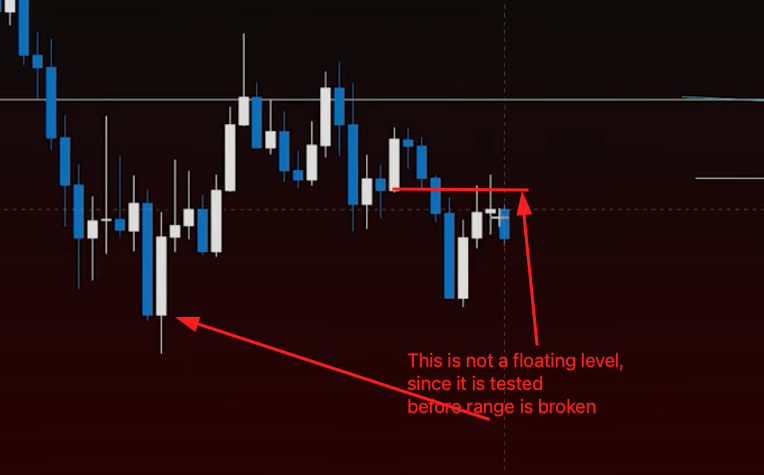

# 🔀 Frontside & Backside Holds

Backside hold level is in the back side of the move and has a strong reaction (knife catch)

Frontside hold level is in the front side of the move and has a weak reaction (greedy level).

## Example 1

<figure><figcaption></figcaption></figure>

FS is to hold the move and catch greedy point

## Example 2

<figure><figcaption></figcaption></figure>

Untested levels are more useful

## Videos






