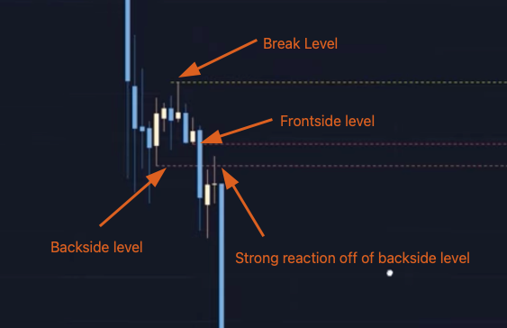

# 📉 Laddering

## Uptrend and downtrend

Ladder creates a trend without breaking wicks

Break levels, Hold levels and trend ultimately creates a Ladder

FS, BS gives entries and ladder point gives maximum reach

Ladder gives max range of a move.

<figure><figcaption></figcaption></figure>

### Hold levels get broken when trend is broken

<figure><figcaption></figcaption></figure>

## Youtube


